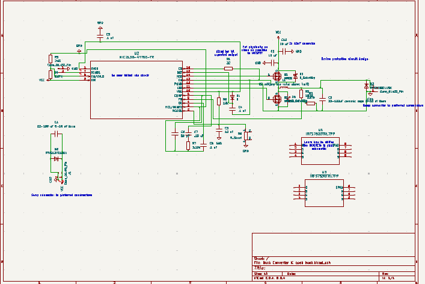

## Members
Matthew Scala, Electric Engineering Student (2028)
matthewscala3820@vt.edu

## Mentor
Ethan James

## Current Status
IN PROGRESS

## Project Overview

Buck converter using MOSFETs

## Educational Value Added
* PCB Design
* Power electronics
